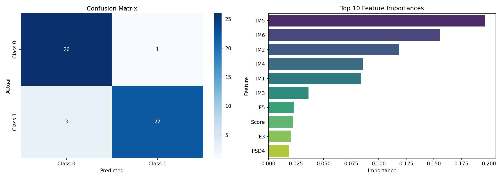

# Student Employability Prediction

Machine learning project predicting student employability using Random Forest classification with 92% accuracy. Includes an interactive Streamlit web app and comprehensive Quarto presentation.

##  Live Demos

** Streamlit App:** [https://anavid-kouki.streamlit.app/](https://anavid-kouki.streamlit.app/) - Interactive predictions
** Presentation:** [http://koukiabderrahmen.me/anavid/presentation.html](http://koukiabderrahmen.me/anavid/presentation.html) - Technical presentation

## 📋 Project Overview

Binary classification model predicting student employability with:
-  Random Forest classifier (92% accuracy)
-  Streamlit web app (manual entry + Excel upload)
-  Quarto slides (technical + non-technical explanations)
-  37 features from 260 student records

## Quick Start

### Option 1: Try the Deployed App
Visit the live Streamlit app (see deployment instructions below) to:
- EnRun Locally

```bash
# Use the quick start script
./run.sh

# Or manually:
source assignment/bin/activate  # Linux/Mac
pip install -r requirements.txt
python classification_model.py  # Train model
streamlit run app.py            # Launch app
```

Visit `http://localhost:8501` in your browser.

```
assignement  (Copy)/
├── classification_model.py   # Model training script
├── app.py                     # Streamlit web application
├── presentation.qmd           # Quarto slides source
├── data.xlsx                  # Training dataset (260 students)
├── requirements.txt           # Python dependencies
├── _quarto.yml               # Quarto configuration
├── custom.scss               # Presentation styling
├── styles.css                # Additional CSS
├── .streamlit/
│   └── config.toml           # Streamlit configuration
├── .github/
│   └── workflows/
│       └── quarto-publish.yml # GitHub Actions for auto-deployment
├── model.pkl                 # Saved trained model
├── imputer.pkl              # Saved preprocessor
├── feature_names.pkl        # Feature list
└── docs/                    # Generated Quarto output (GitHub Pages)
```

## Data

- **File:** `data.xlsx`
- **Size:** 260 students, 39 columns
- **Target:** Binary classification (Class 0 = Not Highly Employable, Class 1 = Highly Employable)
- **Features:** 37 features including:
  - Demographics (Gender, Nationality, Major, Level)
  - Innovation & Entrepreneurship scores (IE1-IE5)
  - Soft Skills scores (SMSK1-SMSK4)
  - Research & Analytical Skills (RAS1-RAS5)
  - Technical & Leadership (TL1-TL3)
  - Professional Skills Development (PSD1-PSD5)
  - Industry Metrics (IM1-IM6)
  - Work Experience (W1-W3)
  - Employment Status & Overall Score

**Class Balance:** Almost perfectly balanced (133 Class 0, 127 Class 1) ✅

## Model Pipeline

### 1. Data Loading
- Reads Excel file directly using pandas and openpyxl

├── classification_model.py   # Model training script
├── app.py                     # Streamlit web application
├── presentation.qmd           # Quarto slides
├── data.xlsx                  # Dataset (260 students, 37 features)
├── requirements.txt           # Dependencies
├── run.sh                     # Quick start script
├── model.pkl                 # Trained model
├── imputer.pkl              # Preprocessor
├── feature_names.pkl        # Feature list
└── .github/workflows/        # GitHub Actions for deployment

## Results

### Cross-Validation Performance
- **Mean F1 Score:** 0.9683 (±0.065)
- Consistent performance across all 5 folds

### Test Set Performance
- **Overall Accuracy:** 92%
- **Class 0:** F1-score 0.93 (Precision: 0.90, Recall: 0.96)
- **Class 1:** F1-score 0.92 (Precision: 0.96, Recall: 0.88)

## Visualizations

The script generates `model_results.png` with two plots:



### Confusion Matrix
Shows the distribution of correct and incorrect predictions for each class.

### Top 10 Feature Importances
Identifies which features the Random Forest model relies on most for making predictions.

---


```


##  Deployment


### Local Quarto Preview
```bash
quarto render presentation.qmd  # Generate slides
quarto preview presentation.qmd # Live preview
```

##  Using the App

**Manual Entry:** Fill 37 fields → Click "Load Example Data" for demo → Predict

**Excel Upload:** Upload .xlsx file → Batch predictions → Download CSV results

**File Format:** Must have all 37 features (see data.xlsx as template) questions or feedback, please open an issue on GitHub.


**Built with   Python, scikit-learn, Streamlit, and Quarto**
Files Generated

- `model.pkl`, `imputer.pkl`, `feature_names.pkl` - Model artifacts
- `model_results.png` - Performance visualizations
- `docs/` - Rendered presentation (GitHub Pages)

---

**Built with Python • scikit-learn • Streamlit •
